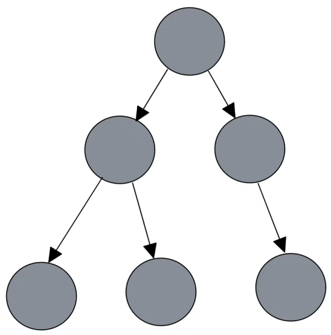
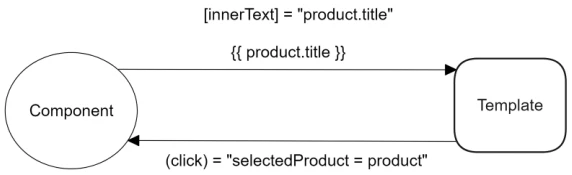
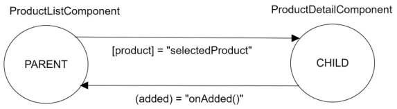
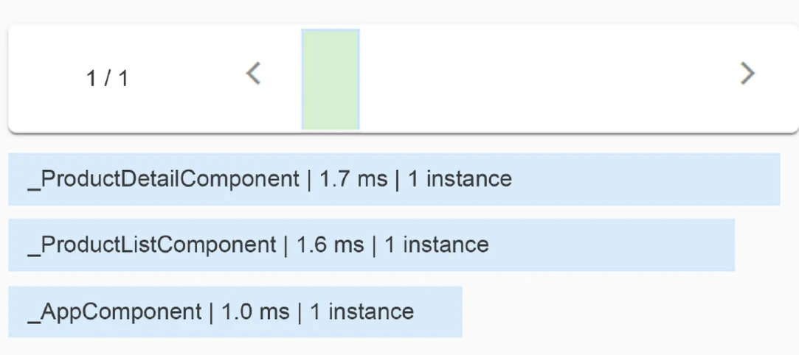
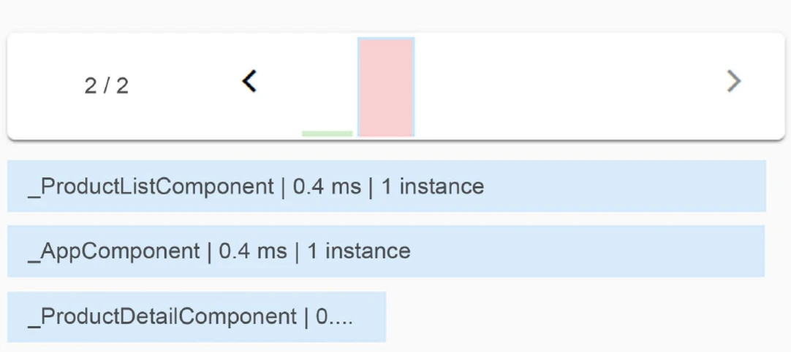
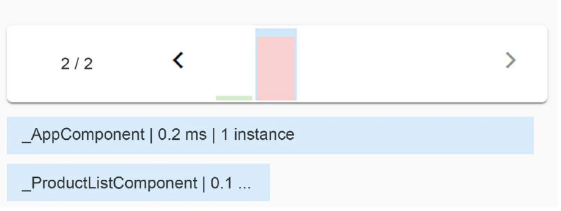
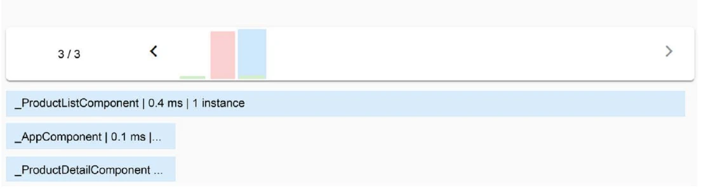
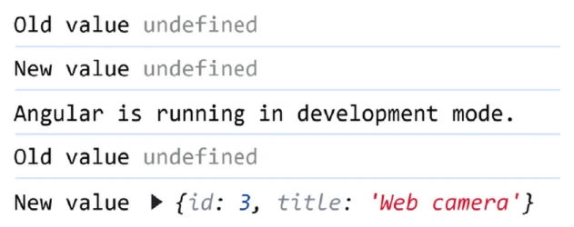

# Structuring User Interfaces with Components

So far, we have had the opportunity to take a bird’s-eye view of the Angular framework. We
learned how to create a new Angular application using the Angular CLI and how to interact with
an Angular component using template syntax. We also explored TypeScript, which will help us
understand how to write Angular code. We have everything we need to explore the further
possibilities that Angular brings to the game regarding creating interactive components and how
they can communicate with each other.

Here we will learn about the following concepts:

- Creating our first component

- Interacting with the template

- Component inter-communication

- Encapsulating CSS styling

- Deciding on a change detection strategy

- Introducing the component lifecycle

## Creating our first component

Components are the basic building blocks of an Angular application. They control different web
page parts called **views**, such as a list of products or an order checkout form. They are responsible
for the presentational logic of an Angular application, and they are organized in a hierarchical
tree of components that can interact with each other:



The architecture of an Angular application is based on Angular components. Each Angular component
can communicate and interact with one or more components in the component tree.
A component can simultaneously be a parent of some child components and a child of another parent component.

In this section, we will explore the following topics about Angular components:

- The structure of an Angular component

- Creating components with the Angular CLI

We will start our journey by investigating the internals of Angular components.

## The structure of an Angular component

As we learned a typical Angular application contains at least a main component that consists of multiple files.
The TypeScript class of the component is defined in the `app.component.ts` file:

```ts
import { Component } from "@angular/core";
import { RouterOutlet } from "@angular/router";

@Component({
  selector: "app-root",
  imports: [RouterOutlet],
  templateUrl: "./app.component.html",
  styleUrl: "./app.component.css",
})
export class AppComponent {
  title = "World";
}
```

The `@Component` is an **Angular decorator** that defines the properties of the Angular component.
An Angular decorator is a method that accepts an object with metadata as a parameter. The metadata
is used to configure a TypeScript class as an Angular component using the following properties:

- `selector`: A CSS selector that instructs Angular to load the component in the location
  that finds the corresponding tag in an HTML template. The Angular CLI adds the `app`
  prefix by default, but you can customize it using the `--prefix` option when creating the
  Angular project.

- `imports`: Defines a list of Angular artifacts that the component needs to be loaded
  correctly, such as other Angular components. The Angular CLI adds the `RouterOutlet` in the
  main application component by default. The `RouterOutlet` is used when we need routing
  capabilities in an Angular application.

- `templateUrl`: Defines the path of an external HTML file that contains the HTML template
  of the component. Alternatively, you can provide the template inline using the `template`
  property.

- `styleUrl`: Defines the path of an external CSS style sheet file that contains the CSS styles of
  the component. Alternatively, you can provide the styles inline using the `styles` property.

In applications built with older Angular versions, you may notice that the `imports`
property is missing from the `@Component` decorator. This is because such components
rely on Angular modules to provide the necessary functionality.

However, starting from Angular v16, the `standalone` property was introduced as an
alternative to Angular modules. With Angular v19, **standalone components** are now
the default and are enforced throughout the project structure. This shift means that
applications created with Angular v19 will utilize the `imports` array in standalone
components by default, marking a significant departure from the module-based
architecture of earlier versions.

Now that we have explored the structure of an Angular component, we will learn how to use the
Angular CLI and create components by ourselves.

## Creating components with the Angular CLI

In addition to the main application component, we can create other Angular components that
provide specific functionality to the application.

To create a new component in an Angular application, we use the `ng generate` command of the
Angular CLI, passing the name of the component as a parameter. Run the following command
inside the root folder of the current Angular CLI workspace:
`ng generate component product-list`

The preceding command creates a dedicated folder for the component named `product-list` that
contains all the necessary files:

- The `product-list.component.css` file, which does not contain any CSS styles yet.

- The `product-list.component.html` file, which contains a paragraph element that displays static text:

  ```html
  <p>product-list works!</p>
  ```

- The `product-list.component.spec.ts` file, which contains a unit test that checks if the
  component can be created successfully:

  ```ts
  import { ComponentFixture, TestBed } from "@angular/core/testing";
  import { ProductListComponent } from "./product-list.component";

  describe("ProductListComponent", () => {
    let component: ProductListComponent;
    let fixture: ComponentFixture<ProductListComponent>;

    beforeEach(async () => {
      await TestBed.configureTestingModule({
        imports: [ProductListComponent],
      }).compileComponents();

      fixture = TestBed.createComponent(ProductListComponent);
      component = fixture.componentInstance;
      fixture.detectChanges();
    });

    it("should create", () => {
      expect(component).toBeTruthy();
    });
  });
  ```

- The `product-list.component.ts` file, which contains the presentational logic of our component:

  ```ts
  import { Component } from "@angular/core";

  @Component({
    selector: "app-product-list",
    imports: [],
    templateUrl: "./product-list.component.html",
    styleUrl: "./product-list.component.css",
  })
  export class ProductListComponent {}
  ```

In this section, we focused on the TypeScript class of Angular components, but how do they
interact with their HTML template?

In the following section, we will learn how to display the HTML template of an Angular component
on a page. We will also see how to use the Angular template syntax to interact between the
TypeScript class of the component and its HTML template.

## Interacting with the template

As we have learned, creating an Angular component using the Angular CLI involves generating
a set of accompanying files. One of these files is the component template containing the HTML
content displayed on the page. In this section, we will explore how to display and interact with
the template through the following topics:

- Loading the component template

- Displaying data from the component class

- Styling the component

- Getting data from the template

We will start our journey in the component template by exploring how we render a component
on the web page.

### Loading the component template

We learned that Angular uses the `selector` property to load the component in an HTML template.
A typical Angular application loads the template of the main component at application startup.
The `<app-root>` tag is the `selector` of the main application component.

To load a component we have created, such as the product list component, we must add its
`selector` inside an HTML template. For this scenario, we will load it in the template of the main
application component:

1. Open the `app.component.html` file and move the contents of the `<style>` tag in the `app.component.css` file.
   _It is more maintainable and considered a best practice to have all CSS styles in a separate file._

2. Modify the `app.component.html` file by adding the `<app-product-list>` tag inside the
   `<div>` tag with the `content` class:

   ```html
   <div class="content">
     <app-product-list></app-product-list>
   </div>
   ```

   We can also use self-enclosing tags, similar to `<input>` and `` HTML
   elements, to add the product list component as `<app-product-list />`.

3. Run the `ng serve` command in a terminal window to start the Angular application. The
   command will fail, stating the following error:

   ```bash
   Application bundle generation failed. [2.669 seconds]

    ✘ [ERROR] NG8001: 'app-product-list' is not a known element:
    1. If 'app-product-list' is an Angular component, then verify that it is included in the '@Component.imports' of this component.
    2. If 'app-product-list' is a Web Component then add 'CUSTOM_ELEMENTS_SCHEMA' to the '@Component.schemas' of this component to suppress this message. [plugin angular-compiler]

    src/app/app.component.html:42:6:
      42 │       <app-product-list />
         ╵       ~~~~~~~~~~~~~~~~~~~~
   ```

   This error is caused because the main application component does not recognize the
   product list component yet.

4. Open the `app.component.ts` file and import the `ProductListComponent` class:

   ```ts
   import { Component } from "@angular/core";
   import { RouterOutlet } from "@angular/router";
   import { ProductListComponent } from "./product-list/product-list.component";

   @Component({
     selector: "app-root",
     imports: [RouterOutlet, ProductListComponent],
     templateUrl: "./app.component.html",
     styleUrl: "./app.component.css",
   })
   export class AppComponent {
     title = "World";
   }
   ```

After the application has been built successfully, navigate to <http://localhost:4200> to preview
it. The web page displays the static text from the template of the product list component.

In the following sections, we will see how to use the Angular template syntax and interact with
the template through the TypeScript class. We will start exploring how to display dynamic data
defined in the TypeScript class of the component.

### Displaying data from the component class

We have already stumbled upon interpolation to display a property value as text from the component
class to the template:

```html
<h1>Hello, {{ title }}</h1>
```

Angular converts the `title` component property into text and displays it on the screen.

An alternative way to perform interpolation is to bind the `title` property to the `innerText`
property of the `<h1>` HTML element, a method called **property binding**:

```html
<h1 [innerText]="title"></h1>
```

In the preceding snippet, we bind to the DOM property of an element and _not_ its HTML attribute,
as it looks at first sight. The property inside square brackets is called the **target property** and is
the property of the DOM element into which we want to bind. The variable on the right is called
the **template expression** and corresponds to the `title` property of the component.

When we open a web page, the browser parses the HTML content of the page and
converts it into a tree structure, the DOM. Each HTML element of the page is converted into an
object called a **node**, which represents part of the DOM. A node defines a set of properties
and methods representing the object API. The `innerText` is such a property and is used to set
the text inside of an HTML element.

To better understand how the Angular templating mechanism works, we first need to understand
how Angular interacts with attributes and properties. It defines HTML attributes to initialize a
DOM property and then uses data binding to interact directly with the property.

To set the attribute of an HTML element, we use the `attr.` syntax through property binding
followed by the attribute name. For example, to set the `aria-label` accessibility attribute of an
HTML element, we would write the following:

```html
<p [attr.aria-label]="myText"></p>
```

In the preceding snippet, `myText` is a property of an Angular component. Remember that property
binding interacts with the properties of an Angular component. Therefore, if we wanted to set the
value of the `innerText` property directly to the HTML, we would write the text value surrounded
by single quotes:

```html
<h1 [innerText]="'My title'"></h1>
```

In this case, the value passed to the `innerText` property is static text, not a component property.

Property binding in the Angular framework binds property values from the component TypeScript
class into the template. As we will see next, the **control flow syntax** is suitable for coordinating
how those values will be displayed in the template.

#### Controlling data representation

The new control flow syntax introduced in the latest versions of the Angular framework allows
us to manipulate how data will be represented in the component template. It features a set of
built-in blocks that add the following capabilities to the Angular template syntax:

- Displaying data conditionally

- Iterating through data

- Switching through templates

In the following sections, we will explore the preceding capabilities, starting with displaying
component data based on a conditional statement.

##### Displaying data conditionally

The `@if` block adds or removes an HTML element in the DOM based on evaluating an expression.
If the expression evaluates to `true`, the element is inserted into the DOM. Otherwise, the element
is removed from the DOM. We will illustrate the use of the `@if` block with an example:

1. Run the following command to create an interface for products:
   `ng generate interface product`

2. Open the `product.ts` file and add the following properties:

   ```ts
   export interface Product {
     id: number;
     title: string;
   }
   ```

   The `Product` interface defines the structure of a `Product` object.

3. Open the `app.component.css` file and move the CSS styles that contain the `h1` and `p`
   selectors in the `product-list.component.css` file.

4. Open the `product-list.component.ts` file and create an empty `products` array:

   ```ts
   import { Component } from "@angular/core";
   import { Product } from "../product";

   @Component({
     selector: "app-product-list",
     imports: [],
     templateUrl: "./product-list.component.html",
     styleUrl: "./product-list.component.css",
   })
   export class ProductListComponent {
     products: Product[] = [];
   }
   ```

   The `products` array will be used to store a list of `Product` objects.

5. Open the `product-list.component.html` file and replace its content with the following
   snippet:

   ```ts
   @if (products.length > 0) {
    <h1>Products ({{products.length}})</h1>
   }
   ```

   The `<h1>` element in the preceding HTML template is rendered on the screen when
   the `products` array is not empty. Otherwise, it is removed completely.

6. The `@if` block behaves similarly to a JavaScript `if` statement. Thus, we can add an `@else`
   section in the component template to execute custom logic when there are not yet any
   products:

   ```html
   @if (products.length > 0) {
    <h1>Products ({{products.length}})</h1>
   } @else {
    <p>No products found!</p>
   }
   ```

   If we had an additional condition that we would like to evaluate, we could
   use an `@else if` section:

   ```html
   @if (products.length > 0) {
    <h1>Products ({{products.length}})</h1>
   } @else if (products.length === 100) {
     <span> Click <a>Load More</a> to see more products </span>
   } @else {
    <p>No products found!</p>
   }
   ```

7. Run the `ng serve` command to preview the application so far.

In applications built with older Angular versions where the control flow syntax is
not available, you may notice the `*ngIf` syntax was used to display conditional data:

```html
<h1 *ngIf="products.length > 0">Products ({{products.length}})</h1>
```

The `*ngIf` is an **Angular directive** with the same behavior as the `@if` block.
However, it is highly recommended to use the `@if` block for the following reasons:

- Makes templates much more readable

- The syntax is closer to JavaScript and is easier to remember

- It is built into the framework and immediately available, which results in
  smaller bundle sizes

You can find more information about `*ngIf` at <https://angular.dev/guide/directives#adding-or-removing-an-element-with-ngif>.

The application we have built does not display any data because the `products` array is empty.
In the following section, we will learn how to add and display product data on the product list
component.

##### Iterating through data

The `@for` block allows us to loop through a collection of items and render a template for each,
where we can define convenient placeholders to interpolate item data. Each rendered template is
scoped to the outer context, where the loop directive is placed so that we can access other bindings.
We can think of the `@for` block as the JavaScript for loop but for HTML templates.

We can use the `@for` block to display the product list in our component as follows:

1. Open the `app.component.css` file and move the CSS styles that contain the `.pill-group`,
   `.pill`, and `.pill:hover` selectors in the `product-list.component.css` file.

2. Modify the `products` array in the `ProductListComponent` class of the `product-list.component.ts`
   file so that it contains the following data:

   ```ts
   export class ProductListComponent {
     products: Product[] = [
       { id: 1, title: "Keyboard" },
       { id: 2, title: "Microphone" },
       { id: 3, title: "Web camera" },
       { id: 4, title: "Tablet" },
     ];
   }
   ```

3. Open the `product-list.component.html` file and add the following snippet after the `@if` block:

   ```html
   <ul class="pill-group">
     @for (product of products; track product.id) {
        <li class="pill">{{product.title}}</li>
     }
   </ul>
   ```

   In the preceding code, we use the `@for` block and turn each item fetched from
   the `products` array into a `product` variable called the **template input variable**.
   We reference the template variable in our HTML by binding its `title` property using
   Angular interpolation syntax.

   During the execution of the `@for` block, data may change, HTML elements may be added,
   moved, or removed, and the whole list may even be replaced. Angular must synchronize
   data changes with the DOM tree by connecting the iterated array and its corresponding
   DOM element. It is a process that can become very slow and expensive and may eventually
   result in poor performance. For that purpose, Angular relies on the `track` property, which
   keeps track of data changes. In our case, the track property defines the property name of
   the `product` variable that will be used to keep track of every item in the `products` array.

4. Run the `ng serve` command to preview the application.

5. The `@for` block supports adding an `@empty` section, which is executed when the array of
   items is empty. We can refactor our code by removing the `@else` section of the `@if` block
   and adding an `@empty` section as follows:

   ```html
   @if (products.length > 0) {
    <h1>Products ({{products.length}})</h1>
   }

   <ul class="pill-group">
     @for (product of products; track product.id) {
        <li class="pill">{{product.title}}</li>
     } @empty {
        <p>No products found!</p>
     }
   </ul>
   ```

The `@for` block can observe changes in the underlying collection and add, remove, or sort the
rendered templates as items are added, removed, or reordered in the collection. It is also possible
to keep track of other useful properties as well. We can use the extended version of the `@for` block
using the following syntax:

```html
@for (product of products; track product.id; let variable=property) {}
```

The `variable` is a template input variable that we can reference later in our template. The `property`
can have the following values:

- `$count`: Indicates the number of items in the array

- `$index`: Indicates the index of the item in the array

- `$first/$last`: Indicates whether the current item is the first or last one in the array

- `$even/$odd`: Indicates whether the index of the item in the array is even or odd

We can use the preceding properties directly or by declaring an alias, as seen in the
following example.

In the following snippet, Angular assigns the value of the `$index` property to the `i` input variable.
The `i` variable is later used in the template to display each product as a numbered list:

```html
@for (product of products; track product.id; let i = $index) {
    <li class="pill">{{i+1}}. {{product.title}}</li>
}
```

Use the `$index` property in the `track` variable when unsure of which one you should
pick from your object data. Additionally, it is recommended to use it when you don’t
have any unique property in your object and you are not modifying the order of the
list by deleting, adding, or moving elements.

In applications built with older Angular versions, you may notice the following
syntax for iterating over collections:

```html
<ul class="pill-group">
  <li class="pill" *ngFor="let product of products">{{product.title}}</li>
</ul>
```

The `*ngFor` is an Angular directive that works similarly to the `@for` block. However,
it is highly recommended to use `@for` for the same reasons mentioned about the `@if`
block in the previous section.

You can find more information about `*ngFor` at <https://angular.dev/guide/directives#listing-items-with-ngfor>.

The last block of the control flow syntax we will cover is the `@switch` block in the following section.

##### Switching through templates

The `@switch` block switches between parts of the component template and displays each depending on a defined value.
You can think of `@switch` like the JavaScript `switch` statement. It consists of the following sections:

- `@switch`: Defines the property that we want to check when applying the block

- `@case`: Adds or removes a template from the DOM tree depending on the value of the
  property defined in the `@switch` block

- `@default`: Adds a template to the DOM tree if the value of the property defined in the `@switch` block does not meet any `@case` statement

We will learn how to use the `@switch` block by displaying a different emoji according to the
product title. Open the `product-list.component.html` file and modify the `@for` block so that it
includes the following `@switch` block:

```html
<ul class="pill-group">
  @for (product of products; track product.id) {
    <li class="pill">
        @switch (product.title) {
            @case ('Keyboard') { ⌨️ }
            @case ('Microphone') { 🎙️ }
            @default { 🏷️ }
        }
        {{product.title}}
    </li>
  } @empty {
    <p>No products found!</p>
  }
</ul>
```

The `@switch` block evaluates the `title` property of each product. When it finds a match, it activates the appropriate `@case` section. If the value of the `title` property does not match any `@case` section, the `@default` section is activated.

In applications built with older Angular versions, you may notice the following
syntax for switching over parts of the template:

```html
<div [ngSwitch]="product.title">
  <p *ngSwitchCase="'Keyboard'">⌨️</p>
  <p *ngSwitchCase="'Microphone'">🎙️</p>
  <p *ngSwitchDefault>🏷️</p>
</div>
```

The `[ngSwitch]` is an Angular directive with the same behavior as the `@switch` block.
However, it is highly recommended to use `@switch` for the same reasons mentioned
about the `@if` block in the previous section.

You can find more information about `[ngSwitch]` at <https://angular.dev/guide/directives#switching-cases-with-ngswitch>.

The simplicity and improved ergonomics of the control flow syntax have enabled the introduction
of the `@defer` block in the Angular framework. The `@defer` block helps to enhance UX and improve
application performance by loading parts of the component template asynchronously.

In this section, we learned how to leverage the control flow syntax and coordinate how data will
be displayed on the component template.

If you want to use this syntax in applications that already use the old directive approach, you can execute the Angular CLI migration described at <https://angular.dev/reference/migrations/control-flow>.

As we will learn in the following section, property binding in the Angular framework applies CSS
styles and classes in Angular templates.

### Styling the component

Styles in a web application can be applied using either the `class` or `style` attribute, or both, of
an HTML element:

```html
<p class="star"></p>
<p style="color: greenyellow"></p>
```

The Angular framework provides two types of property binding:

- Class binding

- Style binding

Let’s begin our journey on component styling with class binding in the following section.

#### Class binding

We can apply a single class to an HTML element using the following syntax:

```html
<p [class.star]="isLiked"></p>
```

In the preceding snippet, the `star` class will be added to the paragraph element when the `isLiked`
expression is `true`. Otherwise, it will be removed from the element. If we want to apply multiple
CSS classes simultaneously, we can use the following syntax:

```html
<p [class]="currentClasses"></p>
```

The `currentClasses` variable is a component property. The value of an expression that is used
in a class binding can be one of the following:

- A space-delimited string of class names such as `'star active'`.

- An object with keys as the class names and values as boolean conditions for each key. A
  class is added to the element when the value of the key, with its name, is evaluated to be
  `true`. Otherwise, the class is removed from the element:

  ```ts
  currentClasses = {
    star: true,
    active: false,
  };
  ```

Instead of styling our elements using CSS classes, we can set styles directly with the `style` binding.

#### Style binding

Like the class binding, we can apply single or multiple styles simultaneously using a style binding.
A single style can be set to an HTML element using the following syntax:

```html
<p [style.color]="'greenyellow'"></p>
```

In the preceding snippet, the paragraph element will have a `greenyellow` color. Some styles can
be expanded further in the binding, such as the `width` of the paragraph element, which we can
define along with the measurement unit:

```html
<p [style.width.px]="100"></p>
```

The paragraph element will be `100` pixels long. If we need to toggle multiple styles at once, we
can use the object syntax:

```html
<p [style]="currentStyles"></p>
```

The `currentStyles` variable is a component property. The value of an expression that is used in
a style binding can be one of the following:

- A string with styles separated by semicolons such as `'color: greenyellow; width: 100px'`

- An object where its keys are the names of styles and the values are the actual style values:

  ```ts
  currentStyles = {
    color: "greenyellow",
    width: "100px",
  };
  ```

Class and style bindings are powerful features that Angular provides out of the box. Together with
the CSS styling configuration that we can define in the `@Component` decorator, it gives endless
opportunities for styling Angular components. An equally compelling feature is the ability to read
data from a template into the component class, which we look at next.

### Getting data from the template

In the previous section, we learned how to use property binding to display data from the component class. Real-world scenarios usually involve bidirectional data flow through components. To get data from the template back to the component class, we use a technique called **event binding**.
We will learn how to use event binding by notifying the component class when a product has
been selected from the list:

1. Open the `product-list.component.ts` file and add a `selectedProduct` property:

   ```ts
   selectedProduct: Product | undefined;
   ```

2. Open the `product-list.component.html` file and use the interpolation syntax to display
   the selected product if it exists:

   ```html
   @if (selectedProduct) {
    <p>
        You selected:
        <strong>{{selectedProduct.title}}</strong>
    </p>
   }
   ```

3. Add a `click` event binding in the `<li>` tag to set the `selectedProduct` to the current
   `product` variable of the `@for` block:

   ```html
   @for (product of products; track product.id) {
   <li class="pill" (click)="selectedProduct = product">
     @switch (product.title) {
        @case ('Keyboard') { ⌨️ }
        @case ('Microphone') { 🎙️ }
        @default { 🏷️ }
    }
    {{product.title}}
   </li>
   }
   ```

4. Run `ng serve` to start the application and click on a product from the list.

An event binding listens for DOM events on the target HTML element and responds to those events
by interacting with members of the component class. The event inside parentheses is called the
**target event** and is the event we are currently listening to. The expression on the right is called the
**template statement** and interacts with the component class. Event binding in Angular supports
all native DOM events found at <https://developer.mozilla.org/docs/Web/Events>.

The interaction of a component template with its corresponding TypeScript class is summarized
in the following diagram:



The same principle we followed for interacting with the component template and class can be
used when communicating between components.

## Component inter-communication

Angular components expose a public API that allows them to communicate with other components.
This API encompasses input properties, which we use to feed the component with data. It
also exposes output properties we can bind event listeners to, thereby getting timely information
about changes in the component state.

In this section, we will learn how Angular solves the problem of injecting data into and extracting
data from components through quick and easy examples.

### Passing data using an input binding

The application currently displays the product list and the selected product details in the same
component. To learn how to pass data between different components, we will create a new Angular
component that will display the details of the selected product. Data representing the specific
product details will be dynamically passed from the product list component.
We will start by creating and configuring the component to display product details:

1. Run the following Angular CLI command to create the new Angular component:
   `ng generate component product-detail`

2. Open the `product-detail.component.ts` file and modify the import statements accordingly:

   ```ts
   import { Component, input } from "@angular/core";
   import { Product } from "../product";
   ```

   The `input` function is part of the Signals API and is used when we want to pass data from
   one component _down_ to another component.

3. Define a `product` property in the `ProductDetailComponent` class that uses the `input` function:

   ```ts
   export class ProductDetailComponent {
     product = input<Product>();
   }
   ```

   In older versions of Angular, we use the `@Input` decorator for passing data
   between components. You can learn more at <https://angular.dev/guide/components/inputs>.

4. Open the `product-detail.component.html` file and add the following contents:

   ```html
   @if (product()) {
    <p>
        You selected:
        <strong>{{product()!.title}}</strong>
    </p>
   }
   ```

   In the preceding snippet, we use an `@if` block to check if the `product` input property has
   been set before displaying its `title`.

5. Open the `product-list.component.ts` file and import the `ProductDetailComponent` class:

   ```ts
   import { Component } from '@angular/core';
   import { Product } from '../product';
   import { ProductDetailComponent } from '../product-detail/product-detail.component';

   @Component({
    selector: 'app-product-list',
    imports: [ProductDetailComponent],
    templateUrl: './product-list.component.html',
    styleUrl: './product-list.component.css'
   })
   ```

6. Finally, replace the last `@if` block in the `product-list.component.html` file with the
   following snippet:

   ```html
   <app-product-detaildetail
     [product]="selectedProduct"
   ></app-product-detaildetail>
   ```

   In the preceding snippet, we use property binding to bind the value of the `selectedProduct`
   property into the `product` input property of the product detail component. This approach
   is called **input binding**.

If we run the application and click on a product from the list, we will see that product selection
continues to work as expected.

The `@if` block in the template of the product detail component implies that the `product` input
property is required; otherwise, it does not display its `title`. Angular does not know if the
product list component passes a value for the `product` input binding during build time. If we want to
enforce that rule during compile time, we can define an input property as required accordingly:

```ts
product = input.required<Product>();
```

According to the previous snippet, if the product list component does not pass a value for the
`product` input property, the Angular compiler will throw the following error:

```bash
[ERROR] NG8008: Required input 'product' from component
ProductDetailComponent must be specified.
```

That’s it! We have successfully passed data from one component to another. In the following
section, we’ll learn how to listen for events in a component and respond to them.

### Listening for events using an output binding

We learned that input binding is used when we want to pass data between components. This
method is applicable in scenarios where we have two components, one that acts as the parent
component and the other as the child. What if we want to communicate the other way, from the
child component to the parent? How do we notify the parent component about specific actions
in the child component?

Consider a scenario where the product detail component should have a button to add the current
product to a shopping cart. The shopping cart would be a property of the product list component.
How would the product detail component notify the product list component that the button was
clicked? Let’s see how we would implement this functionality in our application:

1. Open the `product-detail.component.ts` file and import the `output` function from the
   `@angular/core` npm package:

   ```ts
   import { Component, input, output } from "@angular/core";
   ```

   The `output` function is used when we want to create events that will be triggered from
   one component _up_ to another.

2. Define a new component property inside the `ProductDetailComponent` class that uses
   the `output` function:

   ```ts
   added = output();
   ```

   In older versions of Angular, we use the `@Output` decorator for triggering
   events between components. You can learn more at <https://angular.dev/guide/components/outputs>.

3. In the same TypeScript class, create the following method:

   ```ts
   addToCart() {
    this.added.emit();
   }
   ```

   The `addToCart` method calls the `emit` method on the `added` output event we created in the
   previous step. The `emit` method triggers an event and notifies any component currently
   listening to that event.

4. Now, add a `<button>` element in the component template and bind its `click` event to the
   `addToCart` method:

   ```html
   @if (product()) {
    <p>
        You selected:
        <strong>{{product()!.title}}</strong>
    </p>
    <button (click)="addToCart()">Add to cart</button>
   }
   ```

5. Open the `product-detail.component.css` file and add the following CSS styles that will
   be applied to the `<button>` element:

   ```css
   button {
     display: flex;
     align-items: center;
     --button-accent: var(--bright-blue);
     background: color-mix(in srgb, var(--button-accent) 65%, transparent);
     color: white;
     padding-inline: 0.75rem;
     padding-block: 0.375rem;
     border-radius: 0.5rem;
     border: 0;
     transition: background 0.3s ease;
     font-family: var(--inter-font);
     font-size: 0.875rem;
     font-style: normal;
     font-weight: 500;
     line-height: 1.4rem;
     letter-spacing: -0.00875rem;
     cursor: pointer;
   }

   button:hover {
     background: color-mix(in srgb, var(--button-accent) 50%, transparent);
   }
   ```

6. We are almost there! Now, we need to wire up the binding in the product list component
   so that the two components can communicate. Open the `product-list.component.ts`
   file and create the following method:

   ```ts
   onAdded() {
    alert(`${this.selectedProduct?.title} added to the cart!`);
   }
   ```

   In the preceding snippet, we use the native `alert` method of the browser to display a
   dialog to the user.

7. Finally, modify the `<app-product-detail>` tag in the `product-list.component.html`
   file as follows:

   ```html
   <app-product-detail
     [product]="selectedProduct"
     (added)="onAdded()"
   ></app-product-detail>
   ```

   In the preceding snippet, we use event binding to bind the `onAdded` method into the `added`
   output property of the product detail component. This approach is called **output binding**.

If we select a product from the list and click on the **Add to cart** button, a dialog box will display
a message such as the following: **Web camera added to the cart!**

You can see an overview of the component communication mechanism that we have discussed
in the following diagram:



The output event of the product detail component does nothing more and nothing less than
emitting an event to the parent component. However, we can use it to pass arbitrary data through
the `emit` method, as we will learn in the following section.

#### Emitting data through custom events

The `emit` method of an output event can accept any data to pass up to the parent component. It
is best to define the data type that can be passed to enforce static type checking.

Currently, the product list component already knows the selected product. Let’s assume that
the product list component could only realize it after the user clicks on the **Add to cart** button:

1. Open the `product-detail.component.ts` file and use generics to declare the type of data
   that will be passed into the product list component:

   ```ts
   added = output<Product>();
   ```

2. Modify the `addToCart` method so that the `emit` method passes the currently selected
   product:

   ```ts
   addToCart() {
    this.added.emit(this.product()!);
   }
   ```

3. Open the `product-list.component.html` file and pass the `$event` variable in the `onAdded`
   method:

   ```html
   <app-product-detail
     [product]="selectedProduct"
     (added)="onAdded($event)"
   ></app-product-detail>
   ```

   The `$event` object is a reserved keyword in Angular that contains the payload data of an
   event emitter from an output binding, in our case, a `Product` object.

4. Open the `product-list.component.ts` file and change the signature of the `onAdded`
   method accordingly:

   ```ts
   onAdded(product: Product) {
    alert(`${product.title} added to the cart!`);
   }
   ```

As we saw, output event bindings are a great way to notify a parent component about a change
in the component state or send any data.

Besides using the input and output bindings for communicating with components, we can access
their properties and methods directly using local **template reference variables**.

### Local reference variables in templates

We have seen how to bind data to our templates using interpolation with the double curly braces
syntax. Besides this, we often spot named identifiers prefixed by a hash symbol (`#`) in the elements
belonging to our components or even regular HTML elements. These reference identifiers,
namely, template reference variables, refer to the components flagged with them in our template
views and then access them programmatically. Components can also use them to refer to other
elements in the DOM and access their properties.

We have learned how components communicate by listening to emitted events using output binding
or passing data through input binding. But what if we could inspect the component in depth,
or at least its exposed properties and methods, and access them without going through the input
and output bindings? Setting a local reference on the component opens the door to its public API.

The public API of a component consists of all `public` members of the TypeScript class.

We can declare a template reference variable for the product detail component in the
`product-list.component.html` file as follows:

```html
<app-product-detail
  #productDetail
  [product]="selectedProduct"
  (added)="onAdded()"
></app-product-detail>
```

From that moment, we can access the component members directly and even bind them in other
locations of the template, such as displaying the product title:

```html
<span>{{productDetail.product()!.title}}</span>
```

This way, we do not need to rely on the input and output properties and can manipulate the
value of such properties.

The local reference variable approach is particularly useful when using libraries
where we cannot control the child components to add input or output binding properties.

We have mainly explained how the component class interacts with its template or other com-
ponents but have barely been concerned about their styling. We explore that in more detail next.

## Encapsulating CSS styling

We can define CSS styling within our components to better encapsulate our code and make it
more reusable.
We learned how to define CSS styles for a component using an external CSS file through the `styleUrl` property or by defining CSS styles inside the TypeScript component file with the `styles` property.

The usual rules of CSS specificity govern both ways: <https://developer.mozilla.org/docs/Web/CSS/Specificity>.

Thanks to scoped styling, CSS management and specificity become a breeze on browsers that
support **shadow DOM**. CSS styles apply to the elements contained in the component, but they
do not spread beyond their boundaries.

You can find more detail on shadow DOM at <https://developer.mozilla.org/docs/Web/API/Web_components/Using_shadow_DOM>.

On top of that, Angular embeds style sheets in the `<head>` element of a web page so that they may
affect other elements of our application. We can set up different levels of **view encapsulation** to
prevent this from happening.

View encapsulation is how Angular needs to manage CSS scoping within the component. We
can change it by setting the `encapsulation` property of the `@Component` decorator in one of the
following `ViewEncapsulation` enumeration values:

- `Emulated`: Entails an emulation of native scoping in shadow DOM by sandboxing the
  CSS rules under a specific selector that points to a component. This option is preferred
  to ensure that component styles do not leak outside the component and are not affected
  by other external styles. It is the default behavior in Angular CLI projects.

- `Native`: Uses the native shadow DOM encapsulation mechanism of the renderer that
  works only on browsers that support shadow DOM.

- `None`: Template or style encapsulation is not provided. The styles are injected as they
  were added into the `<head>` element of the document. It is the only option if shadow
  DOM-enabled browsers are not involved.

We will explore the `Emulated` and `None` options due to their extended support using an example:

1. Open the `product-detail.component.html` file and enclose the contents of the `@if` block
   in a `<div>` element:

   ```html
   @if (product()) {
    <div>
        <p>
        You selected:
        <strong>{{product()!.title}}</strong>
        </p>
        <button (click)="addToCart()">Add to cart</button>
    </div>
   }
   ```

2. Open the `product-detail.component.css` file and add a CSS style to change the border
   of a `<div>` element:

   ```css
   div {
     padding-inline: 0.75rem;
     padding-block: 0.375rem;
     border: 2px dashed;
   }
   ```

3. Run the application using the `ng serve` command and notice that the product detail
   component has a dashed border around it when you select a product.

   The style did not affect the `<div>` element in the `app.component.html` file because the
   default encapsulation scopes all CSS styles defined to the specific component.

   The default view encapsulation is `Emulated` if we do not specify one explicitly.

4. Open the `product-detail.component.ts` file and set the component encapsulation to
   `ViewEncapsulation.None`:

   ```ts
   import { Component, input, output, ViewEncapsulation } from '@angular/core';
   import { Product } from '../product';

   @Component({
    selector: 'app-product-detail',
    imports: [],
    templateUrl: './product-detail.component.html',
    styleUrl: './product-detail.component.css',
    encapsulation: ViewEncapsulation.None
   })
   ```

The CSS style leaked to the component tree and affected the `<div>` element
of the main application component.

View encapsulation can solve many issues when styling our components. However, it should be
used cautiously because, as we already learned, CSS styles may leak into parts of the application
and produce unwanted effects.

The change detection strategy is another property of the `@Component` decorator that is very powerful. Let’s examine this next.

## Deciding on a change detection strategy

Change detection is the mechanism that Angular uses internally to detect changes that occur
in component properties and reflect these changes to the view. It is triggered on specific events,
such as when the user clicks a button, an asynchronous request is completed, or a `setTimeout`
and `setInterval` method is executed. Angular uses a process called **monkey patching** to modify
such events by overwriting their default behavior using a library called **Zone.js**.

Every component has a change detector that detects whether a change has occurred in its properties
by comparing the current value of a property with the previous one. If there are differences,
it applies the change to the component template. In the product detail component, when the
`product` input property changes as a result of an event that we mentioned earlier, the change
detection mechanism runs for this component and updates the template accordingly.

However, there are cases where this behavior is not desired, such as components that render a
large amount of data. In that scenario, the default change detection mechanism is insufficient
because it may introduce performance bottlenecks in the application. We could alternatively use
the `changeDetection` property of the `@Component` decorator, which dictates the selected strategy
the component will follow for change detection.

We will learn how to use a change detection mechanism by profiling our Angular application
with Angular DevTools:

1. Open the `product-detail.component.ts` file and create a getter property that returns
   the current product title:

   ```ts
   get productTitle() {
    return this.product()!.title;
   }
   ```

2. Open the `product-detail.component.html` file and replace the `product()!.title` expression
   inside the `<strong>` tag with the `productTitle`:

   ```html
   @if (product()) {
    <p>
        You selected:
        <strong>{{productTitle}}</strong>
    </p>
    <button (click)="addToCart()">Add to cart</button>
   }
   ```

3. Run the application using the `ng serve` command and preview it at <http://localhost:4200>.

4. Start Angular DevTools, select the **Profiler** tab, and click the **Start recording** button to
   start profiling the Angular application.

5. Click on the **Keyboard** product from the product list and select the first bar in the bar
   chart to review change detection.

   

   We can see that change detection is triggered for each component in the component tree of the application.

6. Click on the **Add to cart** button and select the second bar in the bar chart.
   Angular executed change detection in the product detail component even though we did
   not change its properties.

   

7. Modify the `@Component` decorator of the `product-detail.component.ts` file by setting
   the `changeDetection` property to `ChangeDetectionStrategy.OnPush`:

   ```ts
   import { ChangeDetectionStrategy, Component, input, output } from '@angular/core';
   import { Product } from '../product';

   @Component({
    selector: 'app-product-detail',
    imports: [],
    templateUrl: './product-detail.component.html',
    styleUrl: './product-detail.component.css',
    changeDetection: ChangeDetectionStrategy.OnPush
   })
   ```

8. Repeat steps 4 to 6 and observe the output of the second bar in the change detection bar
   chart.

   

   Change detection did not run for the product detail component this time.

9. Click on the Microphone product from the list and observe the new bar in the bar chart.

   

   Change detection ran this time because we changed the reference of the `product` input
   property. If we had just changed a property using the `OnPush` change detection strategy,
   the change detection mechanism would not have been triggered. You can learn about
   more change detection scenarios at <https://angular.dev/best-practices/skipping-subtrees>.

The change detection strategy is a mechanism that allows us to modify the way our components
detect changes in their data, significantly improving performance in large-scale applications. It
concludes our journey of configuring a component, but the Angular framework does not stop there.
As we’ll learn in the following section, we can hook into specific times in the component lifecycle.

## Introducing the component lifecycle

Lifecycle events are hooks that allow us to jump into specific stages in the lifecycle of a component and apply custom logic. They are optional to use but might be valuable if you understand
how to use them.

Some hooks are considered best practices, while others help debug and understand what happens
in an Angular application. A hook has an interface defining a method we need to implement. The
Angular framework ensures the hook is called, provided we have implemented this method in
the component.

Defining the interface in the component is not obligatory but is considered a good
practice. Angular cares only about whether we have implemented the actual method
or not.

The most basic lifecycle hooks of an Angular component are:

- `ngOnInit`: This is called when a component is initialized

- `ngOnDestroy`: This is called when a component is destroyed

- `ngOnChanges`: This is called when values of input binding properties in the component
  change

- `ngAfterViewInit`: This is called when Angular initializes the view of the current component and its child components

All of these lifecycle hooks are available from the `@angular/core` npm package of the Angular
framework.

A full list of all the supported lifecycle hooks is available in the official Angular documentation at <https://angular.dev/guide/components/lifecycle>.

We will explore each one through an example in the following sections. Let’s start with the
`ngOnInit` hook, which is the most basic lifecycle event of a component.

### Performing component initialization

The `ngOnInit` lifecycle hook is a method called during the component initialization. All input
bindings and data-bound properties have been set appropriately at this stage, and we can safely
use them. Using the component `constructor` to access them may be tempting, but their values
would not have been set at that point. We will learn how to use the `ngOnInit` lifecycle hook
through the following example:

1. Open the `product-detail.component.ts` file and add a `constructor` that logs the value of the `product` property in the browser console:

   ```ts
   constructor() {
    console.log('Product:', this.product());
   }
   ```

2. Import the `OnInit` interface from the `@angular/core` npm package:

   ```ts
   import { Component, input, OnInit, output } from "@angular/core";
   ```

3. Add the `OnInit` interface to the list of implemented interfaces of the `ProductDetailComponent` class:

   ```ts
   export class ProductDetailComponent implements OnInit
   ```

4. Add the following method in the `ProductDetailComponent` class to log the same information as in step 1:

   ```ts
   ngOnInit(): void {
    console.log('Product:', this.product());
   }
   ```

5. Open the `product-list.component.ts` file and set an initial value to the `selectedProduct` property:

   ```ts
   selectedProduct: Product | undefined = this.products[0];
   ```

6. Run the application using the `ng serve` command and inspect the output of the browser console:

   ```Bash
   Product: undefined
   Product: Object { id: 1, title: "Keyboard" }
   ```

The first message from the `constructor` contains an `undefined` value, but in the second message,
the value of the `product` property is displayed correctly.

Constructors should be relatively empty and devoid of logic other than setting initial variables.
Adding business logic inside a constructor makes it challenging to mock it in testing scenarios.

Another good use of the `ngOnInit` hook is when we need to initialize a component with data from
an external source, such as an Angular service.

The Angular framework provides hooks for all stages of the component lifecycle, from initialization to destruction.

### Cleaning up component resources

The interface we use to hook on the destruction event of a component is the `ngOnDestroy` lifecycle
hook. We need to import the OnDestroy interface and implement the ngOnDestroy method to
start using it:

```ts
import { Component, input, OnDestroy, output } from "@angular/core";
import { Product } from "../product";

@Component({
  selector: "app-product-detail",
  imports: [],
  templateUrl: "./product-detail.component.html",
  styleUrl: "./product-detail.component.css",
})
export class ProductDetailComponent implements OnDestroy {
  product = input<Product>();
  added = output();

  addToCart() {
    this.added.emit();
  }

  ngOnDestroy(): void {}
}
```

In the preceding snippet, we have added the `OnDestroy` interface and implemented its `ngOnDestroy`
method. We can then add any custom logic in the `ngOnDestroy` method to run code when the
component is destroyed.

A component is destroyed when it is removed from the DOM tree of a web page due to the fol-
lowing reasons:

- Using the `@if` block from the control flow syntax

- Navigating away from a component using the Angular router.

We usually perform a cleanup of component resources inside the `ngOnDestroy` method, such as
the following:

- Resetting timers and intervals

- Unsubscribing from observable streams.

An alternative method to the `ngOnDestroy` lifecycle hook is to use a built-in Angular service such
as `DestroyRef`:

```ts
import { Component, DestroyRef, input, output } from '@angular/core';
import { Product } from '../product';

@Component({
    selector: 'app-product-detail',
    imports: [],
    templateUrl: './product-detail.component.html',
    styleUrl: './product-detail.component.css'
})
export class ProductDetailComponent {
    product = input<Product>();
    added = output();

    constructor(destroyRef: DestroyRef) {
        destroyRef.onDestroy(() => {});
    }

    addToCart() {
        this.added.emit();
    }
}
```

As we will learn using a constructor is one way to inject Angular services into other Angular artifacts.
In this case, the `destroyRef` service exposes the `onDestroy` method, which accepts a callback function as a parameter. The callback function will be called when the component is destroyed.

We have already learned how to pass data down to a component using an input binding. The
Angular framework provides the `ngOnChanges` lifecycle hook, which we can use to inspect when
the value of such a binding has changed.

### Detecting input binding changes

The `ngOnChanges` lifecycle hook is called when Angular detects that the value of an input data
binding has changed. We will use it in the product detail component to learn how it behaves
when we select a different product from the list:

1. Import the `OnChanges` and `SimpleChanges` interfaces in the `product-detail.component.ts` file:

   ```ts
   import {
     Component,
     input,
     OnChanges,
     output,
     SimpleChanges,
   } from "@angular/core";
   ```

2. Modify the definition of the `ProductDetailComponent` class so that it implements the `OnChanges` interface:

   ```ts
   export class ProductDetailComponent implements OnChanges
   ```

3. Implement the `ngOnChanges` method that is defined in the `OnChanges` interface. It accepts
   an object of the `SimpleChanges` type as a parameter that contains one key for each input
   property that changes. Each key points to another object with the properties `currentValue`
   and previousValue, which denote the new and the old value of the input property, respectively:

   ```ts
   ngOnChanges(changes: SimpleChanges): void {
    const product = changes['product'];
    const oldValue = product.previousValue;
    const newValue = product.currentValue;
    console.log('Old value', oldValue);
    console.log('New value', newValue);
   }
   ```

   The preceding snippet tracks the product input property for changes and logs old and
   new values in the browser console window.

4. To inspect the application, run the ng serve command, select a product from the list, and
   notice the output in the console. You should get something like the following:

   

   The first two lines state that the product value was changed from
   `undefined` to `undefined`. It is the actual time when the product detail component is
   initialized, and the `product` property has no value yet. The `OnChanges` lifecycle event is
   triggered once the value is first set and in all subsequent changes that occur through the
   binding mechanism.

5. To eliminate the unnecessary log messages, we can check whether it is the first time that
   the `product` property is being changed using the `isFirstChange` method:

   ```ts
   ngOnChanges(changes: SimpleChanges): void {
    const product = changes['product'];
        if (!product.isFirstChange()) {
            const oldValue = product.previousValue;
            const newValue = product.currentValue;
            console.log('Old value', oldValue);
            console.log('New value', newValue);
        }
   }
   ```

   If we refresh the browser, we can see the correct message in the console window.

The `ngOnChanges` lifecycle hook is a great way to detect when the value of an input property
changes. With the advent of the Signals API, we have much better methods to detect and react
to these changes.
However, for older versions of Angular, the hook is still the preferred solution.

The last lifecycle event of an Angular component we will explore is the `ngAfterViewInit` hook.

### Accessing child components

The `ngAfterViewInit` lifecycle hook of an Angular component is called when:

- The HTML template of the component has been initialized

- The HTML templates of all child components have been initialized

We can explore how the `ngAfterViewInit` event works using the product list and product detail
components:

1. Open the `product-list.component.ts` file and import the `AfterViewInit` and `viewChild`
   artifacts from the `@angular/core` npm package:

   ```ts
   import { AfterViewInit, Component, viewChild } from "@angular/core";
   ```

2. Create the following property in the `ProductListComponent` class:

   ```ts
   productDetail = viewChild(ProductDetailComponent);
   ```

   We have already learned how to query a component class from an HTML template using
   local reference variables. Alternatively, we can use the viewChild function to query a child
   component from the parent component class.

   In older versions of Angular, we use the `@ViewChild` decorator for querying
   child components. You can learn more at <https://angular.dev/guide/components/queries>.

   The `viewChild` function accepts the type of component we want to query as a parameter.

3. Modify the definition of the `ProductListComponent` class so that it implements the
   `AfterViewInit` interface:

   ```ts
   export class ProductListComponent implements AfterViewInit
   ```

4. The `AfterViewInit` interface implements the `ngAfterViewInit` method, which we can
   use to access the `productDetail` property:

   ```ts
   ngAfterViewInit(): void {
    console.log(this.productDetail()!.product());
   }
   ```

   When we query the `productDetail` property, we get an instance of the `ProductDetailComponent` class. We can then access any member of its public API, such as the `product` property.

   Running the preceding code might display an `undefined` value for the `product` property if we do not set an initial value when the product detail component is initialized.

The `ngAfterViewInit` lifecycle event concludes our journey through the lifecycle of Angular
components. Component lifecycle hooks are a useful feature of the framework, and you will use
them a lot for developing Angular applications.

## Summary

So far we explored Angular components. We saw their structure and how to create them
and discussed how to isolate a component’s HTML template in an external file to ease its future
maintainability. Also, we saw how to do the same with any style sheet we wanted to bind to the
component in case we did not want to bundle the component styles inline. We also learned how
to use the Angular template syntax and interact with the component template. Similarly, we
went through how components communicate bidirectionally using property and event bindings.

We went through the options available in Angular for creating powerful APIs for our components
so that we could provide high levels of interoperability between components, configuring their
properties by assigning either static values or managed bindings. We also saw how a component
could act as a host component for another child component, instantiating the former’s custom
element in its template and laying the groundwork for larger component trees in our applications. Output parameters give us the layer of interactivity we need by turning our components
into event emitters so they can adequately communicate with any parent component that might
eventually host them.

Template references paved the way for us to create references in our custom elements, which we
can use as accessors to their properties and methods from within the template in a declarative
fashion. An overview of the built-in features for handling CSS view encapsulation in Angular gave
us additional insights into how we can benefit from shadow DOM’s CSS scoping per component.
Finally, we learned how important change detection is in an Angular application and how we
can customize it to improve its performance further.

We also studied the component lifecycle and learned how to execute custom logic using built-in
Angular lifecycle hooks.
